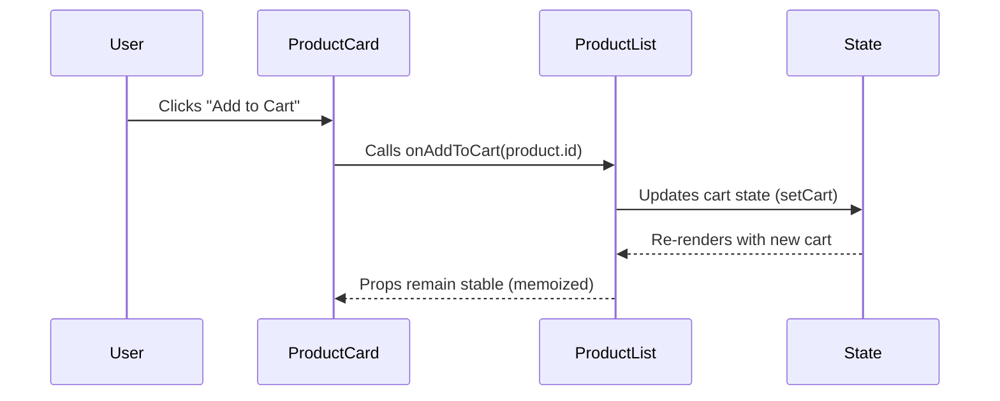

# Step-by-Step Workflow

## Phase 1: Planning

### Identify Component Purpose

- Is it a UI container (e.g., `Card`), logic handler (e.g., `SearchBar`), or page layout?
- **Example**: A `ProductCard` displays product details and handles "Add to Cart" clicks.

### Define Props & State

| Prop          | Type     | Description                     |
| ------------- | -------- | ------------------------------- |
| `product`     | Object   | `{ id, name, price }`           |
| `onAddToCart` | Function | Callback when button is clicked |

```typescript
interface ProductCardProps {
  product: { id: number; name: string; price: number };
  onAddToCart: (id: number) => void;
}
```

---

## Phase 2: Implementation

### Create the Component File

**Structure**:

```
📂 src/
└── 📂 components/
      └── ProductCard/
            ├── ProductCard.jsx // Component logic
            ├── styles.module.css // Styling (optional)
```

### Write the Component

```jsx
// ProductCard/index.jsx
import { useState } from 'react';
import type { ProductCardProps } from './types';

const ProductCard = ({ product, onAddToCart }: ProductCardProps) => {
  const [isHovered, setIsHovered] = useState(false);

  return (
    <div
      className={`card ${isHovered ? 'hover' : ''}`}
      onMouseEnter={() => setIsHovered(true)}
      onMouseLeave={() => setIsHovered(false)}
    >
      <h3>{product.name}</h3>
      <p>${product.price}</p>
      <button onClick={() => onAddToCart(product.id)}>Add to Cart</button>
    </div>
  );
};
```

### Style with Tailwind (or CSS Modules)

```jsx
// Tailwind example
<div className='border p-4 rounded-lg shadow hover:shadow-lg transition-shadow'>
  {/* ... */}
</div>
```

---

## Phase 3: Integration

### Parent Component Interaction

```jsx
// Parent (e.g., ProductList.jsx)
const ProductList = () => {
  const [cart, setCart] = useState([]);

  const handleAddToCart = (productId) => {
    setCart([...cart, productId]);
  };

  return (
    <div>
      {products.map((product) => (
        <ProductCard
          key={product.id}
          product={product}
          onAddToCart={handleAddToCart}
        />
      ))}
    </div>
  );
};
```

---

## Phase 4: Testing

### Unit Tests (React Testing Library)

```jsx
// ProductCard.test.jsx
test('calls onAddToCart when button is clicked', () => {
  const mockAddToCart = jest.fn();
  render(<ProductCard product={mockProduct} onAddToCart={mockAddToCart} />);
  fireEvent.click(screen.getByText('Add to Cart'));
  expect(mockAddToCart).toHaveBeenCalledWith(1); // product.id = 1
});
```

---

## Sequence Diagram (UML)

Visualizes interactions between `ProductCard`, `ProductList`, and state updates.



### Key Interactions:

1. User triggers an event (e.g., button click).
2. Child component (`ProductCard`) calls the parent’s callback (`onAddToCart`).
3. Parent (`ProductList`) updates state.
4. React re-renders only affected components.

---

## Best Practices Recap

| Step               | Practice                         | Example                                    |
| ------------------ | -------------------------------- | ------------------------------------------ |
| **Planning**       | Define props/state types         | TypeScript `interface`                     |
| **Implementation** | Single-responsibility components | `ProductCard` only handles display + click |
| **Styling**        | Use utility-first CSS (Tailwind) | `className="p-4 shadow"`                   |
| **Testing**        | Mock interactions                | `jest.fn()` for callbacks                  |
| **Performance**    | Memoize callbacks                | `useCallback` in parent                    |

---

## Real-World Example: GitHub’s File Explorer

### Component: `FileExplorer`

**Props**:

```typescript
interface FileExplorerProps {
  files: File[];
  onFileClick: (fileId: string) => void;
}
```

**Sequence**:

1. User clicks a file.
2. `FileExplorer` calls `onFileClick(file.id)`.
3. Parent opens the file in a viewer.

---

## Common Pitfalls & Fixes

| Issue                  | Solution                          |
| ---------------------- | --------------------------------- |
| Prop drilling          | Use Context API or Zustand        |
| Unnecessary re-renders | Memoize components (`React.memo`) |
| Complex state logic    | Extract to custom hooks           |

---

## Final Workflow Summary

1. **Plan** → Define props/state.
2. **Build** → Create component + styles.
3. **Integrate** → Connect to parent.
4. **Test** → Verify interactions.
5. **Optimize** → Memoize, reduce re-renders.
