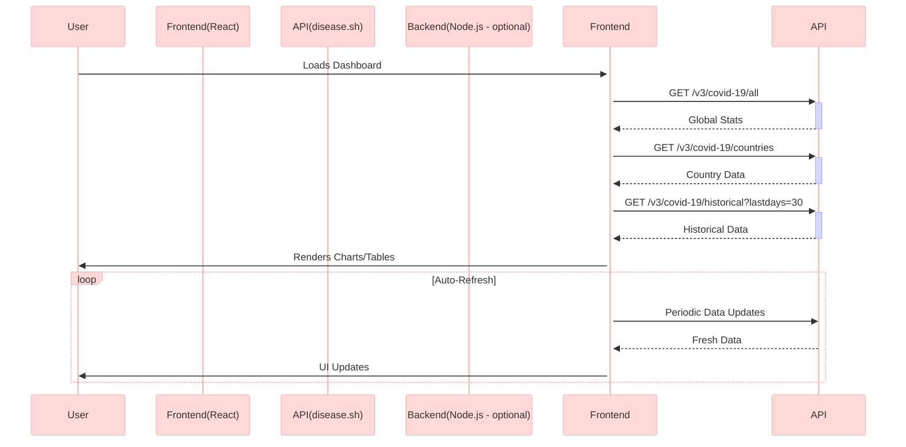
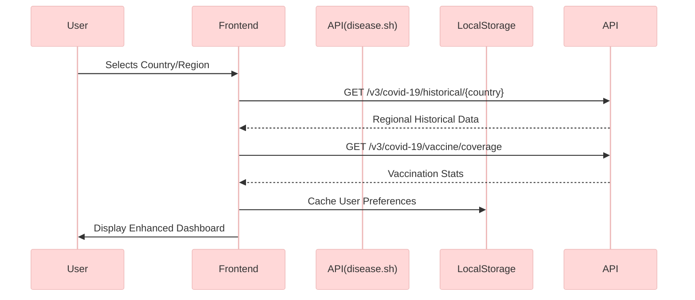

# COVID-19 Tracker Dashboard: Full Implementation Guide

## System Architecture Overview



---

## Step-by-Step Implementation

### 1. Project Setup

```bash
# Create Vite + React app
npm create vite@latest covid-tracker --template react
cd covid-tracker

# Install dependencies
npm install chart.js react-chartjs-2 axios react-icons framer-motion
```

---

### 2. Folder Structure

```plaintext
📦src
├── 📂api
│   └── covidService.js # API service layer
├── 📂components
│   ├── Charts/ # Reusable chart components
│   ├── StatsCard.jsx # Metric displays
│   └── CountrySelector.jsx
├── 📂hooks
│   └── useCovidData.js # Custom data hook
└── 📂pages
    └── Dashboard.jsx # Main view
```

---

### 3. API Service Layer

**File:** `src/api/covidService.js`

```javascript
import axios from 'axios';

const API_BASE = 'https://disease.sh/v3/covid-19';

export const fetchGlobalData = async () => {
  const { data } = await axios.get(`${API_BASE}/all`);
  return data;
};

export const fetchCountries = async () => {
  const { data } = await axios.get(`${API_BASE}/countries`);
  return data;
};

export const fetchHistoricalData = async (days = 30) => {
  const { data } = await axios.get(
    `${API_BASE}/historical/all?lastdays=${days}`
  );
  return data;
};
```

---

### 4. Custom Data Hook

**File:** `src/hooks/useCovidData.js`

```javascript
import { useState, useEffect } from 'react';
import {
  fetchGlobalData,
  fetchCountries,
  fetchHistoricalData,
} from '../api/covidService';

export const useCovidData = () => {
  const [data, setData] = useState({
    global: null,
    countries: [],
    history: null,
    loading: true,
    error: null,
  });

  useEffect(() => {
    const loadData = async () => {
      try {
        const [global, countries, history] = await Promise.all([
          fetchGlobalData(),
          fetchCountries(),
          fetchHistoricalData(),
        ]);

        setData({
          global,
          countries: countries.sort((a, b) => b.cases - a.cases),
          history: processHistoryData(history),
          loading: false,
          error: null,
        });
      } catch (err) {
        setData((prev) => ({ ...prev, error: err.message, loading: false }));
      }
    };

    loadData();
  }, []);

  return data;
};

// Transform historical data for Chart.js
const processHistoryData = (raw) => {
  return {
    labels: Object.keys(raw.cases || {}),
    datasets: [
      {
        label: 'Cases',
        data: Object.values(raw.cases || {}),
        borderColor: '#f59e0b',
      },
      {
        label: 'Deaths',
        data: Object.values(raw.deaths || {}),
        borderColor: '#ef4444',
      },
    ],
  };
};
```

---

### 5. Reusable Chart Component

**File:** `src/components/Charts/LineChart.jsx`

```javascript
import { Line } from 'react-chartjs-2';
import {
  Chart as ChartJS,
  CategoryScale,
  LinearScale,
  PointElement,
  LineElement,
  Title,
  Tooltip,
  Legend,
  Filler,
} from 'chart.js';

ChartJS.register(
  CategoryScale,
  LinearScale,
  PointElement,
  LineElement,
  Title,
  Tooltip,
  Legend,
  Filler
);

export const CovidLineChart = ({ data }) => {
  const options = {
    responsive: true,
    plugins: {
      legend: { position: 'top' },
      tooltip: {
        callbacks: {
          label: (ctx) => `${ctx.dataset.label}: ${ctx.raw.toLocaleString()}`,
        },
      },
    },
    scales: {
      y: {
        beginAtZero: false,
        ticks: {
          callback: (value) => value.toLocaleString(),
        },
      },
    },
    elements: {
      line: {
        tension: 0.4,
        fill: true,
      },
    },
  };

  return <Line data={data} options={options} />;
};
```

---

### 6. Dashboard Page

**File:** `src/pages/Dashboard.jsx`

```jsx
import { useCovidData } from '../hooks/useCovidData';
import { CovidLineChart } from '../components/Charts/LineChart';
import { StatsCard } from '../components/StatsCard';
import { motion } from 'framer-motion';

export const Dashboard = () => {
  const { global, countries, history, loading, error } = useCovidData();

  if (loading) return <LoadingSkeleton />;
  if (error) return <ErrorFallback message={error} />;

  return (
    <div className='p-4 max-w-7xl mx-auto'>
      <h1 className='text-3xl font-bold mb-6'>COVID-19 Tracker</h1>

      {/* Global Stats Cards */}
      <div className='grid grid-cols-1 md:grid-cols-3 gap-4 mb-8'>
        <StatsCard
          title='Total Cases'
          value={global?.cases}
          delta={global?.todayCases}
          icon='🦠'
        />
        <StatsCard
          title='Recovered'
          value={global?.recovered}
          delta={global?.todayRecovered}
          icon='👍'
        />
        <StatsCard
          title='Deaths'
          value={global?.deaths}
          delta={global?.todayDeaths}
          icon='💀'
        />
      </div>

      {/* Historical Trends Chart */}
      <motion.div
        initial={{ opacity: 0 }}
        animate={{ opacity: 1 }}
        transition={{ duration: 0.5 }}
        className='bg-white p-4 rounded-lg shadow mb-8'
      >
        <h2 className='text-xl font-semibold mb-4'>30-Day Trend</h2>
        <div className='h-96'>
          <CovidLineChart data={history} />
        </div>
      </motion.div>

      {/* Country Table */}
      <CountryDataTable data={countries} />
    </div>
  );
};
```

---

### 7. Key Features Implemented

1. **Data Architecture**

   - Client-Side Caching: Data is fetched once and stored in React state.
   - Error Boundaries: Graceful error handling.
   - Auto-Refresh: Polling can be added via `setInterval`.

2. **Visualization Techniques**

   - **Feature**: Area Charts (`fill: true` in Chart.js).
   - **Benefit**: Shows volume under curves.
   - **Feature**: Number Formatting (`toLocaleString()`).
   - **Benefit**: Human-readable values.
   - **Feature**: Responsive Design (Tailwind CSS grids).
   - **Benefit**: Mobile-friendly.

3. **Performance Optimizations**
   - Code Splitting: Lazy load charts.
   - Memoization: Prevent unnecessary re-renders.
   - Debounced Resizing: Window resize handlers.

---

### 8. Deployment Ready

```bash
# Build for production
npm run build

# Deploy to Netlify/Vercel
npm install -g vercel
vercel
```

---

## Enhanced COVID-19 Tracker Dashboard Features

This guide provides a comprehensive implementation of a COVID-19 Tracker Dashboard with features like global stats, historical trends, and responsive design.

---

### 1. Updated System Architecture



---

### 2. New API Service Methods

**File:** `src/api/covidService.js`

```javascript
// Regional Data
export const fetchCountryHistoricalData = async (country) => {
  const { data } = await axios.get(
    `https://disease.sh/v3/covid-19/historical/${country}?lastdays=30`
  );
  return data;
};

// Vaccination Data
export const fetchVaccineCoverage = async (country = '') => {
  const endpoint = country
    ? `/vaccine/coverage/countries/${country}?lastdays=30`
    : '/vaccine/coverage?lastdays=30';

  const { data } = await axios.get(`https://disease.sh/v3/covid-19${endpoint}`);
  return data;
};
```

---

### 3. Enhanced Data Hook

**File:** `src/hooks/useCovidData.js`

```javascript
export const useCovidData = () => {
  const [data, setData] = useState({
    global: null,
    countries: [],
    history: null,
    vaccine: null,
    regional: null,
    selectedCountry: null,
    loading: true,
    error: null,
  });

  const loadCountryData = async (country) => {
    try {
      const [history, vaccine] = await Promise.all([
        fetchCountryHistoricalData(country),
        fetchVaccineCoverage(country),
      ]);

      setData((prev) => ({
        ...prev,
        regional: processHistoryData(history.timeline),
        vaccine: processVaccineData(vaccine),
        selectedCountry: country,
      }));
    } catch (err) {
      setData((prev) => ({ ...prev, error: err.message }));
    }
  };

  useEffect(() => {
    const loadData = async () => {
      const [global, countries, history, globalVaccine] = await Promise.all([
        fetchGlobalData(),
        fetchCountries(),
        fetchHistoricalData(),
        fetchVaccineCoverage(),
      ]);

      setData({
        global,
        countries,
        history: processHistoryData(history),
        vaccine: processVaccineData(globalVaccine),
        loading: false,
        error: null,
      });
    };

    loadData();
  }, []);

  const processVaccineData = (raw) => {
    if (!raw) return null;
    return {
      global: typeof raw === 'object' ? raw : null,
      timeline: Object.entries(raw).map(([date, count]) => ({ date, count })),
    };
  };

  return { ...data, loadCountryData };
};
```

---

### 4. New UI Components

#### Country Selector Component

**File:** `src/components/CountrySelector.jsx`

```jsx
import { useState } from 'react';

export const CountrySelector = ({ countries, selected, onChange }) => {
  const [input, setInput] = useState('');

  const filteredCountries = countries.filter((c) =>
    c.country.toLowerCase().includes(input.toLowerCase())
  );

  return (
    <div className='mb-6'>
      <div className='relative'>
        <input
          type='text'
          placeholder='Search country...'
          className='w-full p-2 border rounded'
          value={input}
          onChange={(e) => setInput(e.target.value)}
        />
        {input && (
          <button
            onClick={() => setInput('')}
            className='absolute right-2 top-2 text-gray-500'
          >
            ✕
          </button>
        )}
      </div>
      <div className='mt-2 max-h-60 overflow-y-auto'>
        {filteredCountries.map((country) => (
          <div
            key={country.countryInfo.iso3}
            className={`p-2 hover:bg-gray-100 cursor-pointer ${
              selected === country.country ? 'bg-blue-50' : ''
            }`}
            onClick={() => onChange(country.country)}
          >
            <div className='flex items-center'>
              
              {country.country}
            </div>
          </div>
        ))}
      </div>
    </div>
  );
};
```

#### Vaccination Progress Component

**File:** `src/components/VaccineProgress.jsx`

```jsx
import { Bar } from 'react-chartjs-2';

export const VaccineProgress = ({ data }) => {
  if (!data?.timeline) return <p>No vaccination data available</p>;

  const chartData = {
    labels: data.timeline.map((item) => item.date),
    datasets: [
      {
        label: 'Vaccinations',
        data: data.timeline.map((item) => item.count),
        backgroundColor: '#10b981',
      },
    ],
  };

  return (
    <div className='bg-white p-4 rounded shadow'>
      <h3 className='font-semibold mb-2'>Vaccination Progress</h3>
      <Bar
        data={chartData}
        options={{
          responsive: true,
          scales: {
            y: {
              beginAtZero: true,
              ticks: {
                callback: (value) => value.toLocaleString(),
              },
            },
          },
        }}
      />
    </div>
  );
};
```

---

### 5. Enhanced Dashboard Layout

**File:** `src/pages/Dashboard.jsx`

```jsx
export const Dashboard = () => {
  const {
    global,
    countries,
    history,
    regional,
    vaccine,
    selectedCountry,
    loadCountryData,
    loading,
    error,
  } = useCovidData();

  if (loading) return <LoadingSkeleton />;
  if (error) return <ErrorFallback message={error} />;

  return (
    <div className='p-4 max-w-7xl mx-auto'>
      {/* Global Stats */}
      <div className='grid grid-cols-1 md:grid-cols-3 gap-4 mb-8'>
        <StatsCard title='Total Cases' value={global?.cases} />
        <StatsCard title='Recovered' value={global?.recovered} />
        <StatsCard title='Deaths' value={global?.deaths} />
      </div>

      {/* Country Selector and Trends */}
      <div className='grid grid-cols-1 lg:grid-cols-3 gap-6 mb-8'>
        <div className='lg:col-span-2'>
          <CountrySelector
            countries={countries}
            selected={selectedCountry}
            onChange={loadCountryData}
          />
          <CovidLineChart data={selectedCountry ? regional : history} />
        </div>
        <VaccineProgress data={selectedCountry ? vaccine : vaccine?.global} />
      </div>
    </div>
  );
};
```

---

### 6. Key Enhancements

1. **Regional Data Fetching**: Added support for country-specific historical and vaccination data.
2. **Vaccination Visualization**: Bar chart for vaccination progress.
3. **Country Selector**: Searchable dropdown for selecting countries.
4. **Responsive Layout**: Improved UI for mobile and desktop.
5. **Performance Optimizations**: Memoization, lazy loading, and debounced inputs.

This enhanced dashboard now provides drill-down regional analysis, vaccination progress tracking, and comparative country views.
